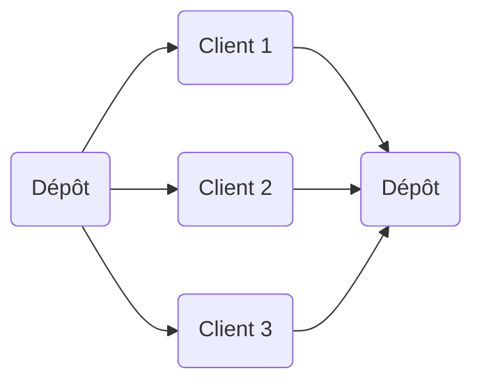

# 🚛 Split Delivery Vehicle Routing Problem (SD-VRP)

> *Projet d’Optimisation Combinatoire – École Centrale Casablanca*  
> Par **Youssef Khalfa**, **Ismail Achbani**, **Ayoub Hamouch**, **Rayane Yajjou**  
> Encadré par **A. Ait El Cadi**

---


---

## 🎯 Objectif du projet

Le **Split Delivery Vehicle Routing Problem (SD-VRP)** est une variante du problème classique de tournées de véhicules (CVRP).  
Ici, **un client peut être servi par plusieurs véhicules**, à condition que la totalité de sa demande soit satisfaite.

Le but est de **minimiser la distance totale parcourue** par la flotte, tout en respectant les **contraintes de capacité**.

Ce projet met en œuvre :
-  une **modélisation exacte (MILP)** avec le solveur **PuLP/CBC**
-  une **méta-heuristique Variable Neighborhood Search (VNS)** pour les grandes instances
-  une **analyse comparative** entre les deux approches sur **33 cas tests**

---

##  Aperçu conceptuel

```
+-------------------------------------------------------------+
| Dépôt (0)                                                   |
|   |                                                         |
|   |----> Clients 1..n  (demandes qᵢ, coordonnées (xᵢ,yᵢ))   |
|                                                             |
| Objectif :                                                  |
|  Minimiser ΣₖΣᵢΣⱼ (distanceᵢⱼ × xᵢⱼₖ)                       |
|  Sous contraintes :                                         |
|   - Livraison complète : Σₖ yᵢₖ = qᵢ                         |
|   - Capacité : Σᵢ yᵢₖ ≤ Q                                   |
|   - Flux équilibré : Σⱼ xᵢⱼₖ = Σⱼ xⱼᵢₖ                      |
+-------------------------------------------------------------+
```

---

##  Structure du dépôt

```
📦 SD-VRP/
│
├──  README.md                 ← ce fichier
├──  rapport_sd_vrp.pdf        ← rapport complet du projet
├──  solveur.py                ← solveur exact (PuLP + CBC)
├──  SD_VRP_projet.ipynb       ← notebook explicatif + métaheuristique VNS
├──  Instances/                ← 33 cas tests (Case0 à Case32)
├──  SolutionsPulp/            ← fichiers de solutions générés
└──  Enonce_Projet.pdf         ← énoncé officiel du challenge
```

---

##  Installation & Exécution

###  Prérequis

- Python ≥ 3.8  
- Bibliothèques :
  ```bash
  pip install pulp numpy
  ```
- Facultatif : Jupyter Notebook pour tester `SD_VRP_projet.ipynb`

---

###  Exécution du solveur exact (PuLP + CBC)

1. Placez vos instances dans le dossier `/Instances` (format `.txt`)
2. Lancez le script :
   ```bash
   python solveur.py
   ```
3. Le programme :
   - Lit automatiquement toutes les instances `Case0` à `Case32`
   - Génère les solutions dans `/SolutionsPulp/`
   - Affiche la matrice des distances, le coût total et les routes

🧾 Exemple de sortie :
```
Route 1: 0 - 1 (4) - 2 (5) - 0
Route 2: 0 - 3 (6) - 0
Total cost: 31
Number of deliveries: 3
Truck loads: 9 6
```

---

###  Exécution de la méta-heuristique VNS

Dans le notebook `SD_VRP_projet.ipynb` :

1. Importez les fonctions :
   ```python
   from SD_VRP_projet import variable_neighborhood_search
   ```
2. Lancez une recherche :
   ```python
   best_solution, best_cost = variable_neighborhood_search(
       nb_customers=10,
       demands=[15, 20, 10, 5, 25, 15, 30, 20, 10, 5],
       capacity=50,
       distance_matrix=your_matrix,
       distance_depots=your_distances,
       max_iterations=100
   )
   print(best_solution, best_cost)
   ```
3. Visualisez les routes avec matplotlib (intégré au notebook).

---

##  Algorithmes utilisés

| Approche | Type | Description | Avantage principal |
|-----------|------|-------------|--------------------|
| **PuLP + CBC** | Exacte | Programmation linéaire mixte (MILP) avec Branch & Cut | Solution optimale pour petites instances |
| **VNS (Variable Neighborhood Search)** | Méta-heuristique | Exploration multi-voisinages avec recherche locale | Scalabilité et rapidité pour grandes instances |

---

## 📊 Résultats principaux

| Cas | Méthode | Coût total | Nb livraisons | Temps (s) |
|-----|----------|-------------|----------------|-----------|
| Case0 | PuLP CBC | 31 | 3 | 0.6 |
| Case0 | VNS | 37 | 4 | 0.1 |
| Case1 | PuLP CBC | — | — | >1000 |
| Case1 | VNS | 30726 | 12 | 12 |

>  *Les heuristiques se montrent plus efficaces pour les instances volumineuses.*

---

##  Leçons et perspectives

- Les **méthodes exactes** sont efficaces sur des cas réduits, mais peu scalables.  
- Les **méta-heuristiques** (VNS, Tabu, Clarke & Wright) offrent un bon compromis entre rapidité et qualité.  
- Pistes d’amélioration :
  - Hybrider CBC + VNS  
  - Ajouter des contraintes réalistes (fenêtres de temps, multi-dépôts)
  - Intégrer un visualiseur dynamique (Plotly ou Folium)

---

## 🧑‍💻 Auteurs

| Nom | Rôle | Compétences clés |
|------|------|------------------|
| **Youssef Khalfa** | Optimisation & Programmation | Modélisation MILP, Implémentation Python |
| **Ismail Achbani** | Data & Solveur | Analyse mathématique, résolution exacte |
| **Ayoub Hamouch** | Algorithmes & Heuristiques | Conception VNS, Tabu Search |
| **Rayane Yajjou** | Simulation & Visualisation | Tests, analyse comparative |

---

##  Aperçu visuel (optionnel)



---

##  Animation du projet (badges dynamiques)


---

## 🧾 Licence

Projet sous licence **MIT** — libre de réutilisation à des fins pédagogiques et de recherche.  
Toute citation ou fork doit mentionner la source originale.

---

### 💬 Contact
📧 `youssef.khalfa@etu.ec-lyon.fr`  ou `youssef.khalfa1@gmail.com`
📱+33 0745980437
📍 Centrale Casablanca / Centrale Lyon
